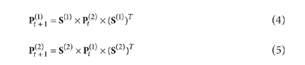

```{r setup, include=FALSE}
knitr::opts_chunk$set(echo = TRUE)
library(SNFtool)
library(tidyverse)
source(here::here("R/source.R"))
```

## Prep

Downloaded companion software SNFtool (2.3.1) from CRAN. 

Simulated data as follows:

90 samples from 3 classes. 

2 data matrices with "complimentary" information that both point toward the 3 classes. 

First dataset: 20 cluster-related features, 50 "noisy" features. 
Second dataset: 10 cluster-related features, 100 "noisy" features. 

```{r load, message = FALSE}

#simulation
#total samples = 90, total features = 70 from one data type, 110 from another. 

set.seed(123)
n1 = 30 #class1
n2 = 30 #class2
n3 = 30 #class3
n = n1+n2+n3
p = 20 #cluster related features in first dataset
q = 50 #noise in first dataset
p2 = 10 #cluster related features in 2nd dataset
q2 = 100 #noise in 2nd dataset

#class1 ~ N(1.5,1), class2 ~ N(0,1), class3 ~ N(-1.5,1)

rnames = paste0("S",1:n)

#simulate features with different distributions specific to the different classes

x = NULL #empty
x1a = matrix(rnorm(n1*p, 1.5, 1), ncol=p)
x2a = matrix(rnorm(n1*p), ncol=p)
x3a = matrix(rnorm(n1*p, -1.5,1), ncol=p)
xa = rbind(x1a,x2a,x3a)
xb = matrix(rnorm(n*q), ncol=q)
x[[1]] = cbind(xa,xb)

## now simulate second data type

################
# sample 10 other informant features in a separate dataset
y1a = matrix(rnorm(n1*p2, 1.5, 1), ncol=p2)
y2a = matrix(rnorm(n1*p2), ncol=p2)
y3a = matrix(rnorm(n1*p2, -1.5,1), ncol=p2)
yb = matrix(rnorm(n*q2), ncol=q2)
ya = standardNormalization(rbind(y1a,y2a,y3a))
x[[2]] = cbind(ya, yb)

head(x[[1]][,1:10])

####
# now what happens when we add a sparse dataset as well??


#true class labels
truelabel = c(rep(1,n1), rep(2,n2), rep(3,n3))
names(truelabel) = rnames


```


## SNF Process using SNFtool package 

Calculate distance matrices (using Euclidean distance as per the paper)

```{r}
# calculate pairwise euclidean distances as specified by paper
dist_1 <- dist2(x[[1]], x[[1]])
dist_2 <- dist2(x[[2]], x[[2]])

head(dist_1[,1:10])
```

Now calculate similarity using 'affinitymatrix' function

Sigma is the hyperparameter, which the paper specifies is usually between 0.3-0.8. 
```{r}
# next make similarity graph. Returns affitinity matrix representing neighborhood graph of the data points
w_1 <- affinityMatrix(dist_1, K = 10, sigma = 0.5)
w_2 <- affinityMatrix(dist_2, K = 10, sigma = 0.5)

head(w_1[,1:10])
```

Use function from within package to visualize heatmap with pre-specified number of clusters to see what clusters would come out from just the separate data types. 

```{r}
displayClusters(w_1, spectralClustering(w_1, K = 3))
displayClusters(w_2, spectralClustering(w_2, K = 3))
```


Now perform similarity network fusion to combine information from both datatypes and identify new clusters.

Below code and comments taken directly from SNFTool documentation:
```{r}
## First, set all the parameters:
K = 20;    # number of neighbors, usually (10~30)
alpha = 0.5;    # hyperparameter, usually (0.3~0.8)
T = 20;   # Number of Iterations, usually (10~20)

## next, we fuse all the graphs
## then the overall matrix can be computed by similarity network fusion(SNF):
W = SNF(list(w_1,w_2), K, T)
```


Visualizing the resulting matrix:

```{r}
displayClusters(W, group= truelabel)
```


```{r include = FALSE}
## With this unified graph W of size n x n, 
## you can do either spectral clustering or Kernel NMF. 

## You can display clusters in the data by the following function
## where C is the number of clusters.
C = 2   							# number of clusters
group = spectralClustering(W,C); 	# the final subtypes information

## Get a matrix containing the group information 
## for the samples such as the SpectralClustering result and the True label
M_label=cbind(group,truelabel)
colnames(M_label)=c("spectralClustering","TrueLabel")

## Use the getColorsForGroups function to assign a color to each group
## NB is more than 8 groups, you will have to input a vector 
## of colors into the getColorsForGroups function
M_label_colors=t(apply(M_label,1,getColorsForGroups))
## or choose you own colors for each label, for example:
M_label_colors=cbind("spectralClustering"=getColorsForGroups(M_label[,"spectralClustering"],
colors=c("blue","green")),"TrueLabel"=getColorsForGroups(M_label[,"TrueLabel"],
colors=c("orange","cyan")))

## Visualize the clusters present in the given similarity matrix 
## as well as some sample information
## In this presentation no clustering method is ran the samples 
## are ordered in function of their group label present in the group arguments
#displayClusters(W, group, M_label_colors[,"spectralClustering"]) 


```

## Looking into iteration step 

Now, let's go back and look at that iteration step. 

I modified the `SNF` function to also spit out the iterations from the "key step of SNF", (modified function is called `SNF_margie` in the code below.)


```{r}
#modified function to also spit out the iterations as well as the final status matrix

w_margie <- SNF_margie(list(w_1, w_2), K, T)

summary(w_margie)
```

Now we can go in and look at the iterations of the similarity graphs from the key step. 

Iteration 1 (1st data type, 2nd data type)
```{r fig.show="hold", out.width="50%"}
displayClusters(w_margie$knn_iterations[[1]][[1]], group)
displayClusters(w_margie$knn_iterations[[1]][[2]], group)
```
Iteration 5
```{r fig.show="hold", out.width="50%"}
displayClusters(w_margie$knn_iterations[[5]][[1]], group)
displayClusters(w_margie$knn_iterations[[5]][[2]], group)
```
Iteration 10
```{r fig.show="hold", out.width="50%"}
displayClusters(w_margie$knn_iterations[[10]][[1]], group)
displayClusters(w_margie$knn_iterations[[10]][[2]], group)
```

Iteration 15
```{r fig.show="hold", out.width="50%"}
displayClusters(w_margie$knn_iterations[[15]][[1]], group)
displayClusters(w_margie$knn_iterations[[15]][[2]], group)
```

Iteration 20
```{r fig.show="hold", out.width="50%"}
displayClusters(w_margie$knn_iterations[[20]][[1]], group)
displayClusters(w_margie$knn_iterations[[20]][[2]], group)
```


## Next steps

* Try out different methods of pairwise distance
* Try using non-continuous data?
* Make one data type more sparse
* Test out effect of sigma parameter on results


